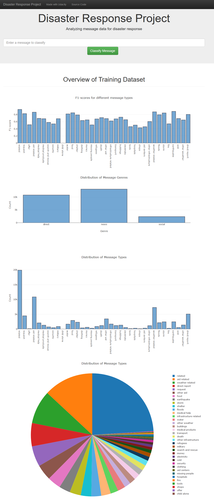
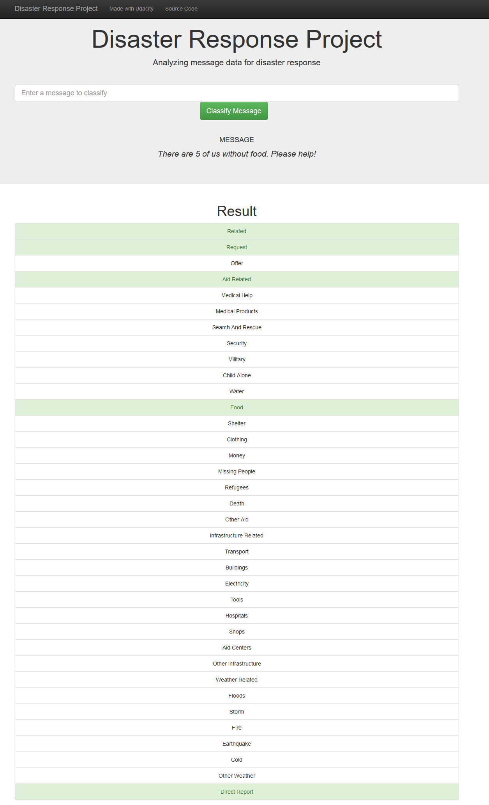

# Disaster Response Pipeline Project

## Description

This project contains web app which can classify emergency messages into 36 categories. Training data was provided by 
[Figure-Eight](https://www.figure-eight.com/). Project is based on [Udacity](https://udacity.com/) data scientist
nano-degree "Disaster Response Pipeline" project. Project structure:

* `app` folder

    * `templates` folder
        * `master.htlm` main page html code for the web app
        * `go.html` web page for classification results
    * `run.py` Flask file that runs app
    
* `data` folder

    * `disaster_categories.csv` contains data about disaster message categories
    * `disaster_messages.csv` contains text data of original and translated disaster messages
    * `process_data.py` python scrip to preprocess csv files for machine learning pipeline
    * `DisasterResponse.db` SQL database with processes data for machine learning pipeline
    
* `models` folder

    * `train_classifier.py` python script with machine learning pipeline
    * `classifier.pkl` trained random forest model
        

## Screenshots

### Main screen

### After submitting message

## How to use

1. Run the following commands in the project's root directory to set up your database and model.

    - To run ETL pipeline that cleans data and stores in database
        `python data/process_data.py data/disaster_messages.csv data/disaster_categories.csv data/DisasterResponse.db`
    - To run ML pipeline that trains classifier and saves
        `python models/train_classifier.py data/DisasterResponse.db models/classifier.pkl`

2. Run the following command in the app's directory to run your web app.
    `python run.py`

3. Go to http://0.0.0.0:3001/

## Requirements

Required list of Python is available on `requirements.txt`.
